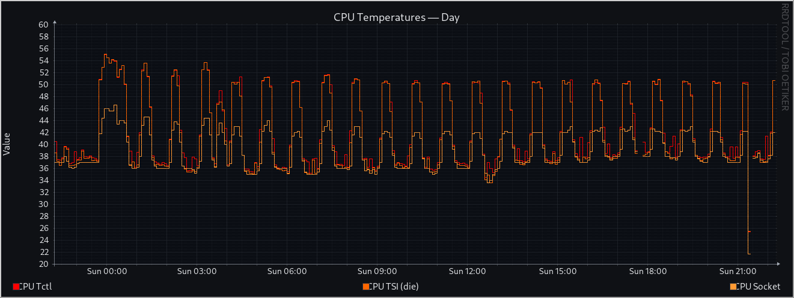
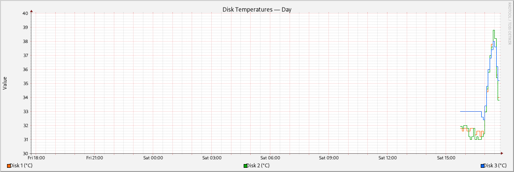

# Unraid RRDTool Monitoring System

A Docker-based sensor monitoring system for Unraid servers using [RRDtool](https://oss.oetiker.ch/rrdtool/), the industry-standard data logging and graphing system. RRDtool has been the backbone of monitoring solutions for decades, powering everything from Nagios to enterprise network monitoring.

## Overview

This system collects and visualizes system metrics from your Unraid server:
- **System sensors**: CPU temperatures, motherboard temperatures, fan speeds (via Linux hwmon)
- **Disk temperatures**: Individual disk monitoring using Unraid's disk information
- **Historical graphs**: Automated PNG graph generation with multiple time ranges

Built on a multi-config architecture where each sensor group (system, disks, etc.) has its own configuration file, RRD database, and graph outputs. All collection and graphing runs automatically via cron inside a Docker container.

## Example Graphs

### System Temperatures (Dark Theme)

*Dark theme with high contrast - ideal for standalone displays*

### Disk Temperatures (Light Theme)

*Light theme matching Unraid web GUI - seamless dashboard integration*

## Features

- **Built-in web server**: View all graphs in your browser at `http://your-server:8080`
- **Theme system**: Light and dark themes with customizable colors and fonts
  - `unraid-light` - Matches Unraid web GUI for seamless dashboard integration
  - `unraid-dark` - High contrast dark theme for standalone displays
  - Support for custom themes with named colors and alpha transparency
- **Multi-config system**: Monitor different sensor groups independently
- **Flexible sensor sources**:
  - Linux hwmon (`sysfs`) for hardware sensors
  - Unraid disk database for disk temperatures
- **Smart hwmon resolution**: Uses chip names instead of unreliable hwmon indices
- **Automated collection**: Runs every minute via cron
- **Automated graphing**: Generates fresh graphs every 15 minutes
- **Configurable time ranges**: 12-hour, day, week, or custom periods
- **Transform expressions**: Apply scaling/calculations to raw sensor values
- **Custom graph scripts**: Full RRDtool power via bash scripts for complex visualizations (stacked areas, inverted IO, threshold lines)
- **Designed for maintainability**: Clean Python code, JSON configs, LLM-friendly architecture

## Quick Start

1. **Clone the repository**:
   ```bash
   git clone https://github.com/mattjoyce/unraid-rrdtool.git
   cd unraid-rrdtool
   ```

2. **Configure your sensors**:
   Edit `config/system.json` and `config/disk.json` to match your hardware

3. **Build and run**:
   ```bash
   docker build -t rrdtool-graphs:latest .
   docker run -d --name rrdtool-graphs --restart unless-stopped \
     -e TZ=Australia/Sydney \
     -p 8080:8080 \
     -v "$PWD/config:/config" \
     -v "$PWD/data:/data" \
     --mount type=bind,source=/sys,target=/hostsys,readonly \
     -v /var/local/emhttp:/var/local/emhttp:ro \
     rrdtool-graphs:latest
   ```

4. **View graphs**:
   - Web interface: Open `http://your-server-ip:8080` in your browser
   - Direct files: Graphs are also available in `./data/graphs/` directory

## Configuration

Each `config/*.json` file defines an independent monitoring group. 

### Themes

Select a theme for each config to control graph appearance:

```json
{
  "schema_version": 2,
  "enabled": true,
  "theme": "unraid-light",
  "prefix": "system",
  ...
}
```

Themes are stored in `config/themes/*.json` and control colors, fonts, and visual styling. Create custom themes by copying and modifying existing ones.

### Example sensor configuration:
```json
{
  "id": "cpu_temp",
  "name": "CPU Temperature",
  "unit": "°C",
  "path": "/hostsys/{k10temp}/temp1_input",
  "transform": "value / 1000",
  "min": 0,
  "max": 150
}
```

The `{k10temp}` placeholder automatically resolves to the correct hwmon device path, even after reboots.

### Custom Graph Scripts

For complex graph types (stacked areas, inverted IO, mixed visualizations, threshold lines), use custom bash scripts instead of JSON definitions. This gives you full access to RRDtool's power while keeping simple graphs simple.

**Example config entry:**
```json
{
  "graphs": [
    {
      "filename": "cpu_temps_12h.png",
      "title": "CPU Temperatures — 12 hours",
      "start": "-12h",
      "series": [
        {"id": "cpu_tctl", "color": "PRIMARY", "legend": "CPU Tctl"}
      ]
    },
    {
      "type": "custom",
      "script": "custom_graphs/nic_io.sh",
      "filename": "nic_io_day.png",
      "start": "-1d",
      "width": 1200,
      "height": 400
    }
  ]
}
```

**Script interface:**

Your custom script receives these positional arguments:
1. `$1` - RRD database path (e.g., `/data/system.rrd`)
2. `$2` - Output PNG path (e.g., `/data/graphs/system_nic_io_day.png`)
3. `$3` - Start time (e.g., `-1d`)
4. `$4` - End time (e.g., `now`)
5. `$5` - Width in pixels (e.g., `1200`)
6. `$6` - Height in pixels (e.g., `400`)
7. `$7` - Theme environment file path (e.g., `/tmp/theme_system.env`)

**Using themes in custom scripts:**

Source the theme env file to access colors and fonts:
```bash
#!/bin/sh
RRD_PATH="$1"
OUTPUT="$2"
START="$3"
END="$4"
WIDTH="$5"
HEIGHT="$6"
THEME_ENV="$7"

# Source theme variables
if [ -f "$THEME_ENV" ]; then
    . "$THEME_ENV"
fi

# Use theme variables in rrdtool command
rrdtool graph "$OUTPUT" \
  --start "$START" --end "$END" \
  --width "$WIDTH" --height "$HEIGHT" \
  --color BACK"${THEME_COLOR_BACK}" \
  --color CANVAS"${THEME_COLOR_CANVAS}" \
  --font DEFAULT:"${THEME_FONT_DEFAULT}" \
  DEF:temp="$RRD_PATH:cpu_temp:AVERAGE" \
  LINE2:temp"${THEME_COLOR_PRIMARY}":"CPU Temperature"
```

**Available theme variables:**
- **Scaffolding colors**: `THEME_COLOR_BACK`, `THEME_COLOR_CANVAS`, `THEME_COLOR_FRAME`, `THEME_COLOR_FONT`, `THEME_COLOR_AXIS`, `THEME_COLOR_GRID`, `THEME_COLOR_MGRID`, `THEME_COLOR_ARROW`
- **Series colors**: `THEME_COLOR_PRIMARY`, `THEME_COLOR_AMBER`, `THEME_COLOR_GREEN`, `THEME_COLOR_RED`, `THEME_COLOR_ACCENT`
- **Alarm colors**: `THEME_COLOR_WARN_HRULE`, `THEME_COLOR_CRITICAL_HRULE`
- **Fonts**: `THEME_FONT_DEFAULT`, `THEME_FONT_TITLE`, `THEME_FONT_AXIS`, `THEME_FONT_LEGEND`

**Example scripts:**

See the `examples/` directory for reference implementations:
- `examples/nic_io.sh` - Network IO with inverted download (Cacti-style)
- `examples/disk_temps_stacked.sh` - Stacked area graph for multiple disks
- `examples/temps_with_thresholds.sh` - Temperature graphs with warning/critical threshold lines

Copy these to `/config/custom_graphs/` and reference them in your config files.

## Project Structure

```
├── config/              # JSON configuration files
│   ├── system.json     # System sensors (CPU, motherboard, fans)
│   ├── disk.json       # Disk temperature monitoring
│   └── themes/         # Graph theme files
│       ├── unraid-light.json
│       └── unraid-dark.json
├── theme_loader.py     # Theme loading and color resolution
├── data/               # RRD databases and generated graphs
└── Dockerfile          # Container definition
```

## Credits

Built with [RRDtool](https://oss.oetiker.ch/rrdtool/) by Tobi Oetiker - a time-tested, rock-solid data logging and graphing system that's been the foundation of monitoring solutions since the late 1990s. From Nagios deployments to enterprise network operations, RRDtool just works.

## Documentation

- [info.md](info.md) - Additional project information

## License

See LICENSE file for details.
